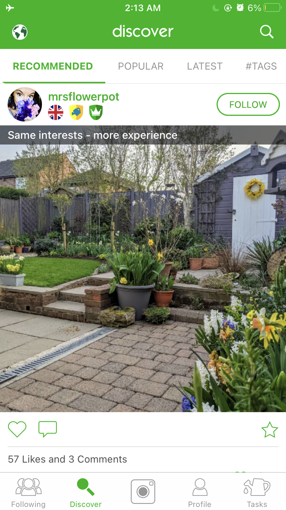
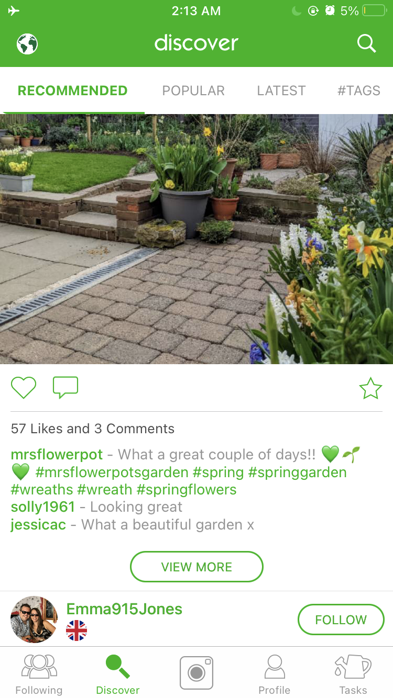
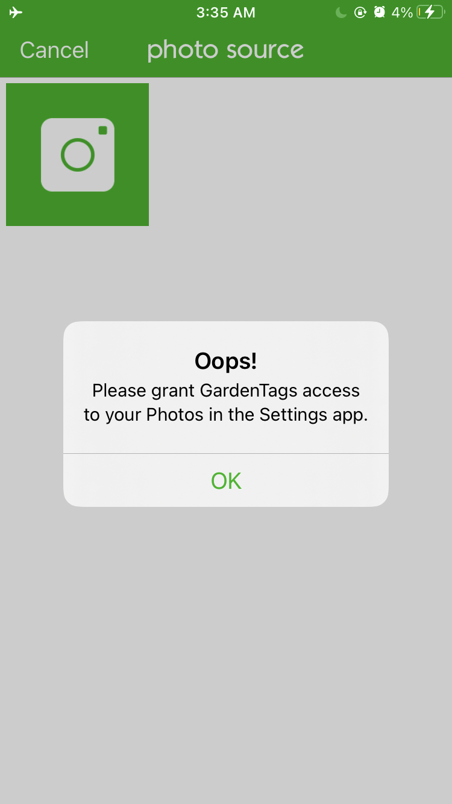
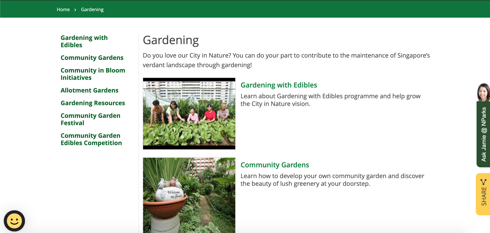
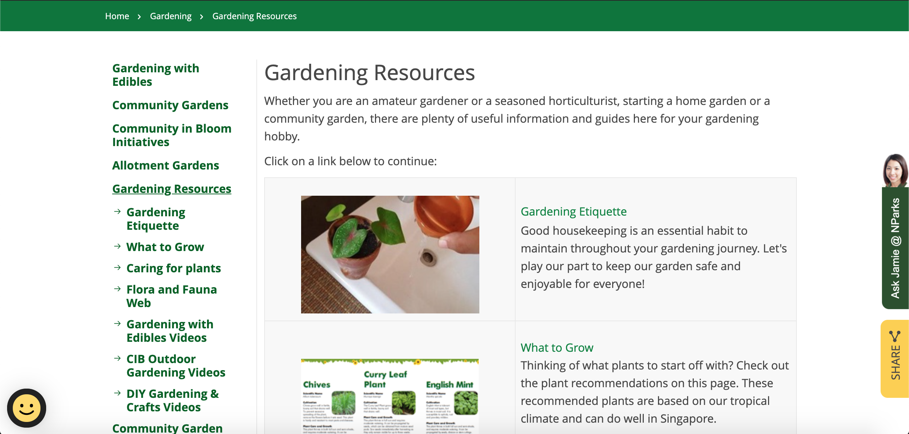

# Assignment 1: Heuristic Evaluation
## DH110, Aditi Melkote

## Grow as you go: Gardening for beginners

> Over the course of the past year, the COVID-19 pandemic has resulted in limited social interaction and extended periods of time at home. During this time, I looked to many activities to fill my time, and found that gardening and learning about growing and nurturing plants became one of my favourite things to do. I find it very calming, meaningful and joyful to see my plants grow, figure out what they need, and learn about how best to care for them. Walking around my apartment complex over the past few months, I noticed that many windows and balconies which were previously empty also started to fill up with plants of all kinds, indicating that gardening is an activity many people in my area have become interested in. 

> Given my personal interest and the budding interest in my local community, through this project I hope to create an all-in-one platform that provides beginners a clear starting point and the necessary guidance in their gardening journey, as well as the ability to connect with and learn from other gardeners in their community.

### Severity Rating
1 = Cosmetic problem only: need not be fixed unless extra time is available on
project

2 = Minor usability problem: fixing this should be given low priority

3 = Major usability problem: important to fix, so should be given high priority

Credit: https://www.nngroup.com/articles/how-to-conduct-a-heuristicevaluation/

## App: GardenTags

App downloaded through the Apple Store

URL for download: https://apps.apple.com/us/app/garden-tags-plant-identification/id852472656)

*This app can be likened to having a social media platform dedicated specifically to
gardening, with the additional feature of creating to-do lists for garden
maintenance. The app allows users to post pictures of their gardens, as well as
find and follow other gardeners based on filters such as experience level, space
available for gardening, and location. These functionalities of the app make it a
good model for the kind of platform I would like to create, so I will be using it as a
reference.*

   |  
  

> **Overall Evaluation:** In general, the app is easy to navigate and use, with and seems
to be primarily targeted towards people seeking a virtual community for
gardening. It has some issues with respect to intuitive design, as well as with
flexibility and efficiency of certain features. Overall though, it fulfils its role as a
platform for gardening enthusiasts to share photos and connect with one another
quite well.

### **1. Visibility of system status** 
**Good:** The icons at the bottom are highlighted in green when user navigates to a page, further the name of that page also appear in the top banner, thus there is clear indication of which page a user is on. The tabs on the top of the discover page also function similarly - they turn from grey to green and underlined when selected, so the user knows which tab they are on. Additionally the icons to like, comment, and save a post also get highlighted in green to indicate that the corresponding action has been performed.
  
*No improvements: For this heuristic there seem to be enough measures in place for the user to clearly understand which tab or page of the app they are on, and which actions they have performed.*

### **2. Match between system and real world**

**Good:** The discover page, which contains a constantly updating feed of posts,can be navigated naturally by scrolling down to reveal more posts. In the profile section, there are plus icons in regions where the user can add more information, which is again an intuitive use of the plus symbol. The camera icon in the bottom middle also clearly indicates its purpose for taking pictures. 

**Bad:** The "View More" button below each post does not make it explcitly clear as to what kind of information it will reveal more of - turns out, on tapping the button, it reveals more comments related to the post, which is not initially obvious. Also, there is a lack of intuitive design when it comes to searching for tags - under the "#Tags" tab, there is no option to search for tags. Instead, users have to tap on the search icon in the top right to be able to search for tags. The encyclopedia functionality, which allows users to search for different plant names and pictures, is placed under the "following" page, which is not where a user would naturally think to look for an encyclopedia function.

*Improvements: The "View More" button could be renamed to "View More Comments" or something similar which makes it clear that it will allow users to see more comments on the post. There could also be a search functionality within the "#Tags" tab, as opposed to in a separate location, making searching for tags more convenient and intuitive. As for the encyclopedia functionality, as per its purpose to help users search for and discover information about plants, it would make sense to be placed under the "discover" page.* 

**Severity Rating:** 2

### 3. User control and freedom

**Good:** The app allows users to enter and exit tabs and pages simply by tapping a different tab or page. The tabs at the top of the "discover" page allows users to the choice to navigate between different categories. The globe icon at the top left of the "discover" page also allows users to change their country of location as they wish, giving them access to posts and users from different locations. Users can follow others by tapping on the follow button next to posts, and unfollow by pressing the same button thereby easily undoing the action. Users can also go into their settings and edit their profile to update their information as and when they wish to.

*No Improvements: Overall the app allows enough freedom and control for the user to navigate, make changes and adjust the way they interact with it to their preferences.*

### 4. Consistency and standards

**Good:** The design and functioning of the tabs in each page is consistent - all of them become highlighted and underlined in green when selected, and turn grey when not selected.

*No Improvements: The overall design of the app is very consistent across all its pages.*

### 5. Error prevention

**Good:** When initially signing up for the app, the user is asked to provide information such as first name, surname, email, and create a password - if any of these fields were left empty, the app would show an error message upon submission and prompt the user to go back and fill in the necessary data. When signing up, the app also asks users about their gardening interests, and provides a checklist - the app clearly indicates that users can select more than one option in this checklist, so that users don't make the mistake of assuming they can select only one and unintentionally limiting themselves.

**Bad:** Upon selecting the icon to buy a plant, it leads to a blank page with no information.

*Improvements: Provide some kind of information instead of leaving the page blank, such as that the plant is unavailable. Leaving the page blank causes the user to question whether it is an issue with the app or with their internet connection, which can cause them to be frustrated.*

**Severity rating:** 3

### 6. Recognition rather than recall

**Good:** The icons to like a post is a heart, to comment on a post is a speech bubble, and to save a post is a star - all these icons are very intuitive in terms of what they do, and are replicated from other social media platforms such as instagram which have popularised and normalised their meaning and purpose, so the user knows what to do when they encounter these icons below posts in this app.

*No Improvements: The app generally has enough similarities to popular social media platforms, particularly instagram, to allow for recogntion of common icons and functionalities and reduce the cognitive load on the user.*

### 7. Flexibility and efficiency of use

**Bad:** Under each post, the number of likes and comments the post received is indicated - however the user cannot tap on this information to find out who liked the posts or read other comments. Instead, they have to tap on the "View More" button, which leads to another page with all the comments, and on this second page, the user needs to tap the number of likes, which will lead to yet another page showing the users who liked the post. Thus there are a lot of unnecessary steps to determine some basic information.

*Improvements: Instead of leading to multiple pages, the app can be configured such that simply tapping on the number of likes and comments information below the post leads directly to the required data.*

**Severity rating:** 2

### 8. Aesthetic and minimal design:

**Good:** The colour scheme is very simple, comprised of only two colours - green and white. The design of the "discover" page in particular is rather crowded, with multiple tabs at the top of the page, buttons on the side and below each post, as well as an additional search functionality on the top right and location-changing functionality on the top left.

*Improvements: In conjunction with the above heuristic on efficiency of use, the "Latest", "Popular", and "#Tags" tabs could likely be removed - users could instead be prompted to search for this information when the click on the search icon on the top right. This would help improve the cluttered layout and make more space on the screen for the posts.*

**Severity rating:** 2

### 9. Help users recognise, diagnose, and recover from errors

**Good:** When a user performs an error, the app makes use of friendly and forgiving language, such as saying "Oops!, which puts the user at ease. It also provides clear instructions on how to proceed and undo the error - when a user wants to add a task through the "Tasks" page, they need to provide camera access, if they don't, an "Oops!" error message is displayed and the user is informed that camera access is required to proceed.

*No Improvements: The app is able to quickly indicate errors to users and guide them through fixing the error and moving on very well.*

### 10. Help and documentation

**Good:** After initially signing up for the app, there is a short tutorial that takes users through the various pages and functionalities of the app, providing initial help for new users

**Bad:** Following this initial tutorial, there are no help pages or tabs within the app, meaning users are left to themselves to figure out how things work if they forget.

*Improvements: Add a "help" page within the app, or provide a link to an online FAQ or customer service page outside the app, so that users can seek help as they need it.*

**Severity rating:** 3

---

## Website: National Parks - Gardening

URL: https://www.nparks.gov.sg/gardening

*This website is a respository of gardening information, with lots of information specific to Singapore, where I live. The site provides resources for gardeners, information on community gardens, and other garden-related events . As I am interested in creating a platform to connect gardeners within my local community, referencing the National Parks website and the resources it provides will be very relevant and useful to my project.*

##### Home Page:
 

##### One of the pages within the website:

>Overall evaluation: This is quite a straightforward and simple site, targeted at people looking to learn more about the practice of gardening as well as gardening-related events. There are some issues mainly relating to consistency of the pages within the site, but these are not too problematic towards the user experience of the site.

### 1. Visibility of system status

**Good:** The various pages within the website are listed along the left side, as well as in the middle with picture - hovering over and selecting one of the pages makes it underlined, indicating that it has been selected. For some of the pages, upon selection there will be a further menu of links that appear below it, which also will be underlined when clicked on, so the user knows which page they are on in the site.

*No Improvements: The website has measures that clearly indicate which page the user is on.*

### 2. Match between system and real world

**Good:** When the user scrolls to the bottom of the page, a "Back to Top" button appears on the bottom right. It only appears towards the bottom of the page, and disappears once back at the top. This makes sense in terms of its purpose - we would only expect to go back to the top of the page once we scroll down, and accordingly, the "Back to Top" button only appears at the bottom of the page.

**Bad:** The order of pages on the page is quite unintuitive, particularly for a beginner. Beginner users would expect the first page link on the website to be "Gardening resources", which details how to care for plants and which plants to start growing. Instead, "Gardening resources" is the fourth link on the website's landing page, and the first few links are related to community gardening initiatives.

*Improvements: "Gardening resources" should be moved up to being the first page linked on the site, followed by other links to community gardening and events.*

**Severity rating:** 2

### 3. User control and freedom

**Good:** Users can easily enter and exit pages in the website. Firstly, they can select the pages they wish to enter into by clicking on the links to the left, or the links alongside pictures and descriptions in the main body of the site. Once inside a particular page, users can exit the page simply by clicking on a different page along the page links on the left, or by clicking on the title of the previous page on the directory in the green banner along the top of the site. Also, if users mistakenly click on the "Ask Jamie @NParks" help button on the right of the page, there is a minimise icon which can undo the action and collapse the help button once again.

*No Improvements: The site has enough measures to allow users to easily navigate into and out of pages within it.*

### 4. Consistency and standards

**Good:** The location of the help button, share button, and rating button is the same on all pages in the site.

**Bad:** For some of the pages, the embedded links appear both as a list under the page title in the menu on the left as well as in the main body of the page. However in other pages, embedded links are only provided under the page title in the menu, but not within the body of the page itself. In order to use the "Ask Jamie @NParks" help button, the user has to click on it. However to use the share button right below it, the user has to hover over it to expand the button, then click on the relevant icons. Also, lack of consistency in the shade of green used for hyperlinks in certain pages means that users sometimes click on green text that is not a hyperlink by mistake, which can be frustrating.

*Improvements: Display all embedded links within the body of the site as well, so as to maintain consistency in the design and users' expectations of where the links will be on the page. Make the action to use the help and share buttons consistent - either require both buttons to be clicked on, or both to be hovered over to use. Also, use a consistent shade of green for hyperlinked text.*

**Severity rating:** 2

### 5. Error prevention

**Good:** When clicking on the icons to share to twitter or facebook, the site redirects to a draft post  instead of directly posting, thus giving the user the opportunity to backtrack and delete the post if it was unintentional, or check for any last errors before posting it.

*No improvements: There are not many errors to be committed within the use of this site as it is quite simplistic in design and purpose, and it is able to provide measures for error prevention.*

### 6. Recognition rather than recall

**Good:** The website uses the well-known icons to indicate sharing to twitter and facebook, so the user is already aware of what clicking on those icons will do. The website also makes use of a smiley face emoji in the bottom left to indicate that clicking on the emoji will request users to rate the site.

*No Improvements: The site makes good use of popular icons and their meanings so that users can quickly recognise what they mean without too much effort.*

### 7. Flexibility and efficiency of use

**Good:** The nesting of further links within pages ensures that information is well organised, allowing for efficient navigation of the site. In terms of flexibility, the users are given the option to view embedded videos either on the page itself, or navigate to YouTube or other external site if they prefer. The help button, which allows users to speak with a virtual assistant, consists of list of frequently asked questions and hot topics, cutting down the time required by users to communicate with the virtual asistant if they find their query in the list provided - thus increasing the efficiency of their experience.

**Bad:** Again, as mentioned under consistency and standards, full flexibility is prevented by the fact that in some cases users can navigate embedded links along the side menu and within the page, while in other cases they cannot.

*Improvements: Provide embedded page links both in the side menu and in the page itself to allow for flexibility with navigation.*

**Severity rating:** 2

### 8. Aesthetic and minimal design:

**Good:** Simple colour scheme composed of dark greens, greys, and beige. The layout of the site is also very minimal and easy to understand and navigate.

**Bad:** The left menu takes up close to a third of the space on the site.

*Improvements: Make the menu on the left collapsible, so that there is more space for the main body content of the site.*

**Severity rating:** 1

### 9. Help users recognise, diagnose, and recover from errors

**Good:** Some of the links in the site's pages were no longer working and led to error 404 pages - however they clearly explained that there was no content on the page, and provided a link to go back to the home page.

*No Improvements: The site is able to help users identify when errors have occurred and tell them how to move forward following the error.*

### 10. Help and documentation

**Good:** The website has both and FAQ page at the bottom, as well as a virtual assistant button on the right side - this virtual assistant is available for each page in the website, and also comes with a list current top topics and questions. Thus users have two different modes of seeking help with any issues they may face while usingthe website, or to get any queries answered.

*No Improvements: The site provides sufficient resources for users looking for help.*

